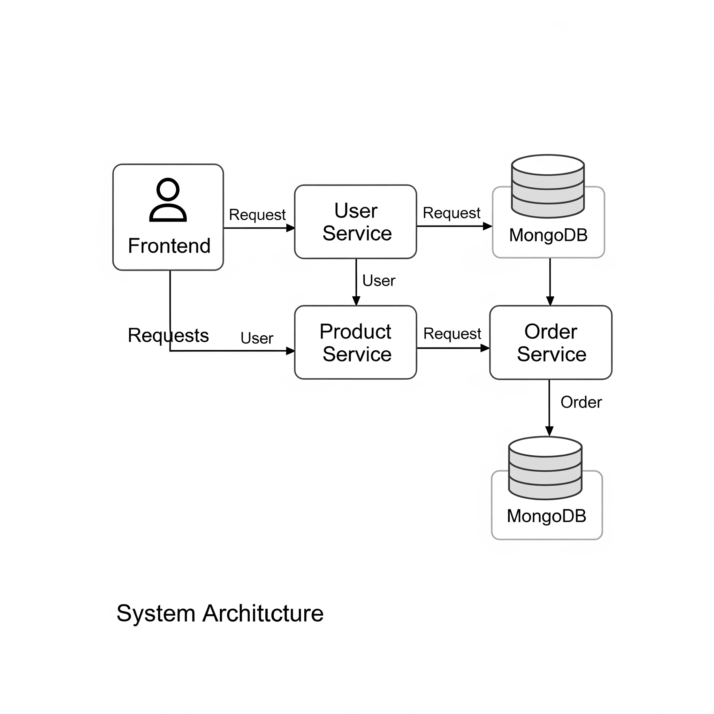
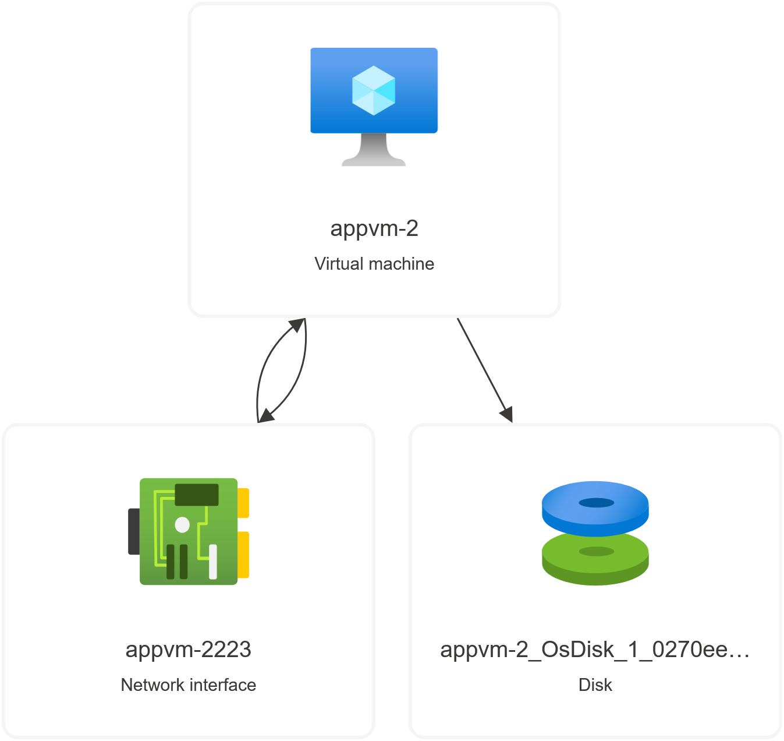

# ezbuy-ecoomerce

# EzBuy - Premium Electronics E-commerce Platform

A modern, microservices-based e-commerce platform specializing in premium electrical devices and electronics.

## 🏗️ Application Architecture

EzBuy follows a **microservices architecture** with four main services:




### Service Communication
- **HTTP REST APIs** for inter-service communication
- **JWT tokens** for authentication across services
- **Async validation** between services for security
- **Centralized authentication** through User Service

## 🛠️ Technology Stack

### Backend Services
- **Runtime**: Node.js 18+
- **Framework**: Express.js
- **Database**: MongoDB with Mongoose ODM
- **Authentication**: JSON Web Tokens (JWT)
- **Security**: bcrypt for password hashing
- **CORS**: Cross-Origin Resource Sharing enabled
- **HTTP Client**: Axios for service-to-service communication

### Frontend
- **Core**: Vanilla JavaScript (ES6+)
- **Styling**: Custom CSS with modern design patterns
- **Architecture**: Single Page Application (SPA)
- **UI/UX**: Responsive design with mobile-first approach
- **Notifications**: Custom toast and modal systems

### DevOps & Deployment
- **Containerization**: Docker for each service
- **Base Image**: node:18-alpine (lightweight)
- **Process Management**: npm scripts
- **Development**: nodemon for hot reloading

### Design Patterns
- **Microservices**: Service-oriented architecture
- **RESTful APIs**: Resource-based URL design
- **MVC Pattern**: Model-View-Controller separation
- **Middleware Pattern**: Express.js middleware chain
- **Authentication Middleware**: JWT validation layer

## 🚀 Features & Functionality

### 👥 User Management
- **User Registration**: Secure account creation with validation
- **Authentication**: JWT-based login system
- **Role-based Access**: User and Admin role separation
- **Profile Management**: User profile viewing and updates
- **Security**: Password hashing, token validation, session management

### 📦 Product Catalog
- **Product Display**: Rich product information with images
- **Search & Filter**: Category, brand, price range filtering
- **Inventory Management**: Real-time stock tracking
- **Product CRUD**: Admin-only create, read, update, delete operations
- **Categories & Brands**: Dynamic filtering options

### 🛒 Shopping Experience
- **Shopping Cart**: Add, remove, update quantities
- **Persistent Cart**: Local storage for cart persistence
- **Real-time Updates**: Live cart count and totals
- **Stock Validation**: Prevent overselling

### 📋 Order Management
- **Order Processing**: Complete checkout workflow
- **Payment Methods**: Multiple payment options
- **Order Tracking**: Status updates and history
- **Admin Dashboard**: Order management and status updates
- **Inventory Sync**: Automatic stock updates on orders

### 🛡️ Admin Panel
- **Dashboard**: Order statistics and revenue tracking
- **Product Management**: Full CRUD operations
- **Order Management**: Status updates and order tracking
- **User Management**: Admin role assignment
- **Analytics**: Basic reporting and statistics

### 🎨 User Interface
- **Modern Design**: Clean, professional interface
- **Responsive Layout**: Mobile-friendly design
- **Interactive Elements**: Smooth animations and transitions
- **Notification System**: Toast notifications and modals
- **Loading States**: User feedback during operations

## 📁 Project Structure

```
ezbuy/
├── frontend/
│   ├── public/
│   │   ├── index.html          # Home page
│   │   ├── login.html          # Authentication
│   │   ├── products.html       # Product catalog
│   │   ├── cart.html           # Shopping cart
│   │   ├── orders.html         # Order history
│   │   ├── admin.html          # Admin panel
│   │   ├── app.js              # Main application logic
│   │   └── style.css           # Styling
│   ├── server.js               # Express static server
│   ├── package.json
│   └── Dockerfile
├── user-service/
│   ├── server.js               # User authentication service
│   ├── package.json
│   └── Dockerfile
├── product-service/
│   ├── server.js               # Product catalog service
│   ├── package.json
│   └── Dockerfile
└── order-service/
    ├── server.js               # Order management service
    ├── package.json
    └── Dockerfile
```

## 🔒 Security Features

### Authentication & Authorization
- **JWT Tokens**: Secure token-based authentication
- **Role-based Access**: Admin and user role separation
- **Token Validation**: Cross-service token verification
- **Session Security**: Secure token storage and management

### Data Protection
- **Password Hashing**: bcrypt with salt rounds
- **Input Validation**: Server-side validation
- **SQL Injection Prevention**: MongoDB/Mongoose protection
- **CORS Configuration**: Controlled cross-origin requests

### Admin Security
- **Admin Authentication**: Enhanced admin verification
- **Access Logging**: Security event logging
- **Route Protection**: Admin-only endpoint protection
- **Token Validation**: Multi-layer authentication checks


## 🌐 API Endpoints

### User Service (Port 3001)
- `POST /api/auth/register` - User registration
- `POST /api/auth/login` - User authentication
- `GET /api/auth/validate` - Token validation
- `GET /api/user/profile` - User profile

### Product Service (Port 3002)
- `GET /api/products` - Get all products
- `GET /api/products/:id` - Get single product
- `POST /api/products` - Create product (Admin)
- `PUT /api/products/:id` - Update product (Admin)
- `DELETE /api/products/:id` - Delete product (Admin)

### Order Service (Port 3003)
- `POST /api/orders` - Create order
- `GET /api/orders` - Get user orders
- `PATCH /api/orders/:id/cancel` - Cancel order
- `GET /api/admin/orders` - Admin order management
- `PATCH /api/orders/:id/status` - Update order status (Admin)

## 🚀 Getting Started

### Prerequisites
- Node.js 18+
- MongoDB
- Docker (optional)


## 📱 Responsive Design

The application is fully responsive and optimized for:
- **Desktop**: Full-featured experience
- **Tablet**: Touch-optimized interface  
- **Mobile**: Mobile-first responsive design
- **Cross-browser**: Modern browser compatibility

## 🔧 Development Features

- **Hot Reloading**: Development with nodemon
- **Error Handling**: Comprehensive error management
- **Logging**: Service activity monitoring
- **Health Checks**: Service status endpoints
- **Code Organization**: Modular, maintainable structure

---
##Hosting in Azure
Architecture



*Built with ❤️ for modern e-commerce experiences*
by
Dhananjaya Kurukulasooriya,
Isuru ,
Nushan


